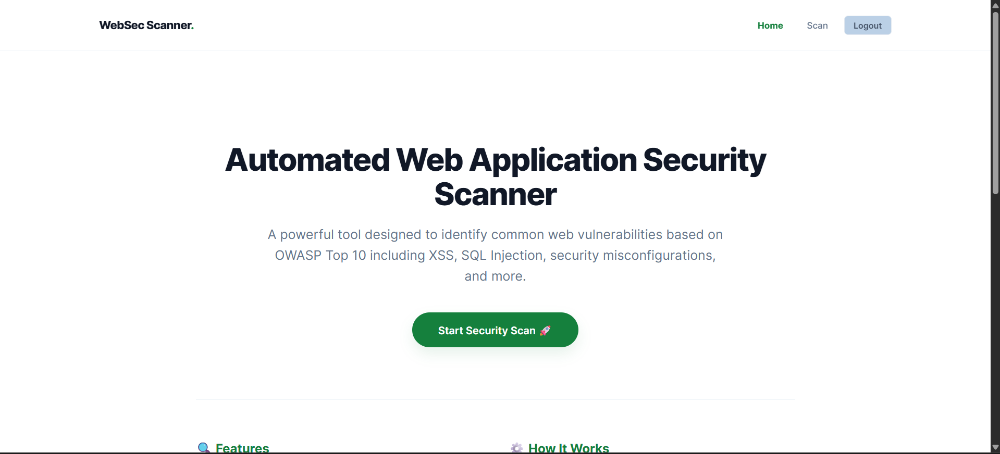
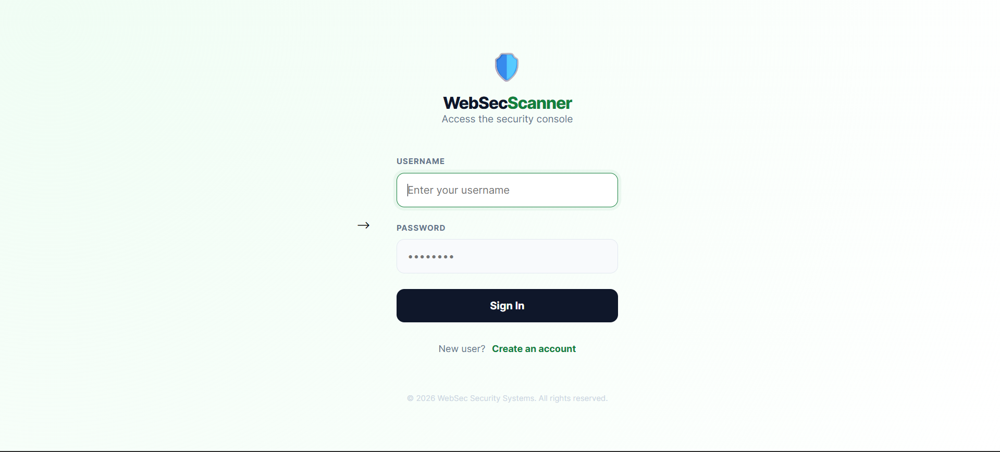
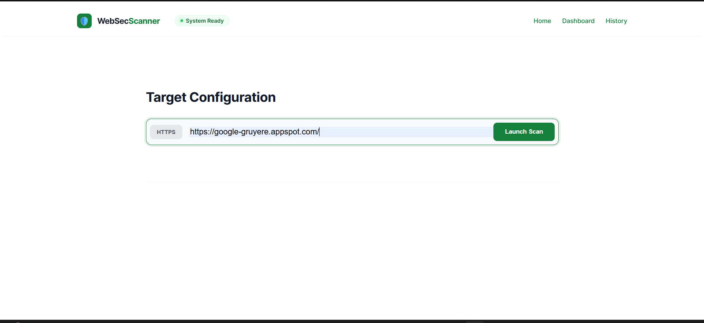
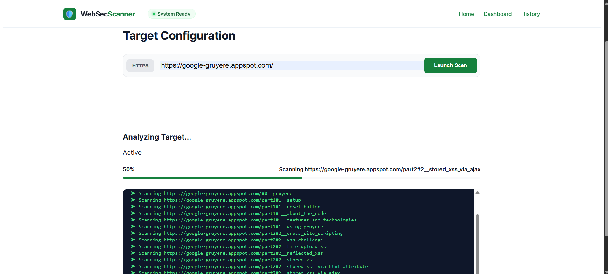
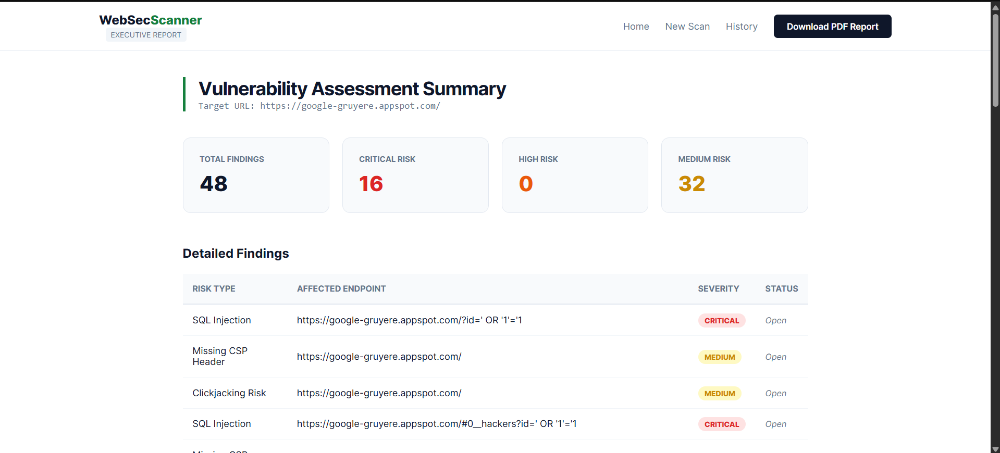
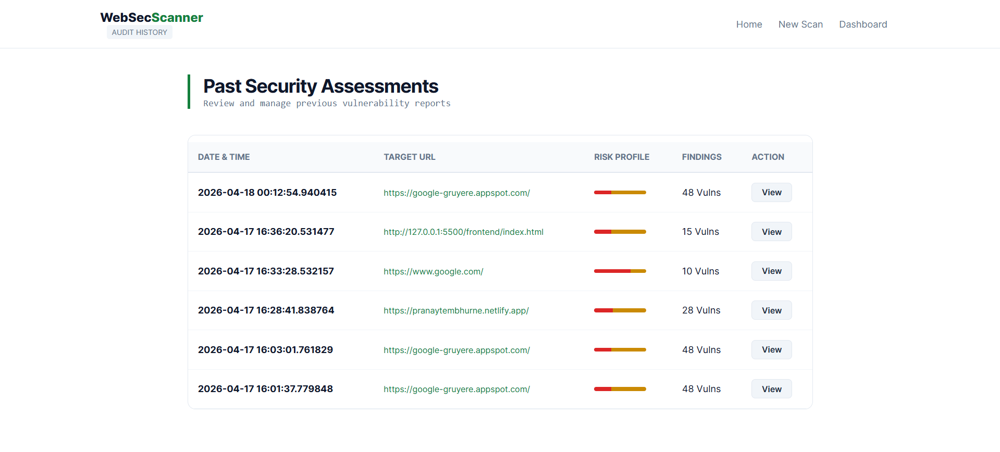

# 🛡️ Web Security Scanner

A full-stack **Web Application Security Scanner** designed to detect common vulnerabilities based on the **OWASP Top 10**.  
Built with a focus on real-world security workflows, multi-user support, and detailed reporting.

---

## 🚀 Features

- 🔐 User Authentication (Login / Signup)
- 👤 Multi-user support (data isolation per user)
- 🌐 Automated Website Crawling
- 🧪 XSS (Cross-Site Scripting) Detection
- 💉 SQL Injection Detection
- 🛡️ Security Headers Analysis
- 📊 Interactive Dashboard 
- 📜 Scan History (per user)
- 📄 Downloadable PDF Reports

---

## 🧠 Tech Stack

**Frontend**
- HTML, CSS, JavaScript
- Chart.js (for visualization)
- html2pdf.js (for report export)

**Backend**
- Python (Flask)
- REST APIs + Server-Sent Events (SSE)

**Database**
- SQLite (user + scan storage)

---

## 🔐 Authentication System

- JWT-based authentication
- Token required for protected routes
- Each user can only access their own scan data
- Works across multiple devices

---

## 📊 Dashboard

- Displays latest scan results
- Shows:
  - Total vulnerabilities
  - Critical / High / Medium breakdown
- Interactive severity chart (like Burp Suite / OWASP ZAP)

---

## 📜 Scan History

- Stores all previous scans in database
- User-specific history
- View detailed reports anytime

---

## ⚙️ How It Works

1. User logs in
2. Enters target URL
3. Scanner:
   - Crawls website
   - Tests endpoints
   - Detects vulnerabilities
4. Results stored in database
5. Dashboard + History display results

---

## 📸 Screenshots

### Home Page


### Login Page


### Search


### Scan Page


### Dashboard


### History


### Pdf


---

## 🖥️ Installation & Setup

### 1. Clone Repository
```bash
git clone https://github.com/your-username/web-sec-scanner.git
cd web-sec-scanner


cd backend
python -m venv .venv
.venv\Scripts\activate   # Windows
pip install -r requirements.txt


python app.py

http://127.0.0.1:5000


web-sec-scanner/
│
├── backend/
│   ├── app.py
│   ├── database/
│   ├── scanner/
│
├── frontend/
│   ├── index.html
│   ├── login.html
│   ├── signup.html
│   ├── scan.html
│   ├── dashboard.html
│   ├── history.html
│
├── static/
│   ├── css/
│   ├── js/


⚠️ Disclaimer

This tool is built for educational and security research purposes only.
Do not scan websites without proper authorization.

👨‍💻 Author

Yash Wadbude
Cybersecurity Enthusiast | Ethical Hacking | Web Security

⭐ Future Improvements
🔍 Advanced vulnerability detection
📈 More visual analytics
☁️ Deployment (cloud-based scanning)
🔐 Password hashing & security improvements
🌟 Support

If you like this project:

⭐ Star the repo
🍴 Fork it
📢 Share it
